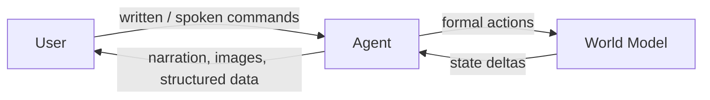

# Gnusto

**An LLM-powered interactive fiction system built on the Grue language.**

Gnusto is a research project exploring a simple idea: keep a *formal, analyzable world
model* at the center of a text adventure, and use a language model only at the edges — to
parse what the player says and to narrate what the world does back. The world model
enforces the rules; the LLM provides the prose.


*The web UI mid-game in The Lurking Horror, with generated scene art and a structured
view of the current room.*

---

## How it works

A Grue game is a pure, immutable world model. The agent translates free-form player input
into formal actions, the world applies them and returns structured state deltas, and the
agent narrates the result. Because the world is the source of truth, the LLM can't "cheat"
the rules — and because effects are declarative, the same model can be explored statically
(see **Frotz** below).



See [`docs/gnusto.md`](docs/gnusto.md) for the full architecture.

---

## Components

The project is several loosely-coupled tools at different stages of maturity.

### Grue — the language

*Status: ✅ usable, actively evolving*

A LISP/Scheme/Clojure-flavored language for defining IF worlds: rooms, objects, actors,
events, and behaviors. State is immutable and all side effects flow through a formal
effects system, which is what makes static analysis tractable.

- Code: [`src/grue/`](src/grue/) (parser, runtime, REPL, save, render)
- Reference: [`docs/grue.md`](docs/grue.md)
- Design notes & open questions: [`docs/grue_notes.md`](docs/grue_notes.md)
- Tooling: `grue-repl` (explore a world), `grue-test` (run `.test.grue` suites)

### Gnusto — the evaluation harness

*Status: ✅ terminal · 🚧 web · 🔮 voice*

The LLM player: agent loop, model interface, knowledge/state tracking, and rendering.

- Code: [`src/gnusto/`](src/gnusto/)
- UI modes ([`docs/ui.md`](docs/ui.md)):
  - **Terminal** ✅ — Rich-formatted TUI, pipe-friendly (default)
  - **Web** 🚧 — Svelte + Vite UI with scene art and a structured room view ([`src/gnusto/webui/`](src/gnusto/webui/)) — pictured above
  - **Voice** 🔮 — planned
- Model experimentation (small/local models, fine-tuning) is ongoing — see the
  [Roadmap](#roadmap).

### Frotz — static analysis

*Status: 🚧 core working, tool suite in progress*

Abstract interpretation over the Grue effects system to verify winnability, detect
soft-locks, and extract walkthroughs. The core `reach` and `analyze` commands work today;
a broader suite of authoring/design tools is planned.

- Code: [`src/frotz/`](src/frotz/)
- Docs: [`docs/frotz.md`](docs/frotz.md)
- CLI: `frotz reach`, `frotz analyze`

### Filfre — scene illustration

*Status: 🚧 experimental, standalone*

Generates *static* illustrations for rooms, characters, and objects via the NanoBanana
(Google Gemini 2.5 Flash Image) cloud backend. Named after the Enchanter spell for
gratuitous fireworks. Standalone — not wired into the runtime loop; it produces image
assets that the web UI consumes. (The earlier on-the-fly composition system has been
retired; the direction is pre-rendering art keyed to reachable game states — see
[`docs/render.md`](docs/render.md).)

- Code: [`src/filfre/`](src/filfre/)
- Docs: [`docs/render.md`](docs/render.md) (pipeline & visual style), [`docs/filfre.md`](docs/filfre.md) (CLI)
- CLI: `filfre generate`
- Related art/composition R&D lives in [`experiments/`](experiments/)
  (archived dynamic composition, overlays, layout, and [art-sourcing research](experiments/art-sourcing-research.md)).

### ZIL → Grue conversion stack

*Status: 🚧 partial*

A pipeline for porting original Infocom ZIL sources into Grue. The `zilch` converter does a
mechanical first pass into a `converted/` subdirectory; behaviors are then hand-translated
into authoritative root `.grue` files (workflow in [`games/notes.md`](games/notes.md)).
**The Lurking Horror** is the lead conversion and primary driver of language features —
see [`games/lurkinghorror/README.md`](games/lurkinghorror/README.md).

- Code: [`src/zil/`](src/zil/) (tokenizer, parser, AST, loader, extractor) + `src/grue/converter.py`
- CLI: `zilch`

### Editor tooling

*Status: ✅ tree-sitter + Zed · 🔮 LSP*

A [tree-sitter grammar](https://github.com/joelgwebber/tree-sitter-grue) provides syntax
highlighting and outline support, with a Zed extension under `editors/zed/` in that repo. A
Grue LSP (goto-def/ref, refactoring) is planned (yak `gnusto-cb51`).

---

## Games

| Game | Status | Notes |
|------|--------|-------|
| `testgame` | ✅ Fixture | Minimal world used across tests |
| `lurkinghorror` | 🚧 In progress | Lead conversion — 41 source files, 19 test suites |
| `zork1`, `enchanter`, `amfv` | 🌱 Planned | ZIL source staged, conversion not started |
| `bureaucracy` | 🌱 Planned | Placeholder |

---

## Installation

```bash
uv sync                 # install deps + project (editable)
# or
pip install -e .
```

Image generation needs extra dependencies (the external image API client, plus an optional
local GPU pipeline): `pip install -e '.[render]'`. Local-model experiments use `'.[mlx]'`.

## Quickstart

```bash
gnusto games/lurkinghorror/             # play in the terminal (default)
gnusto games/lurkinghorror/ --web       # play in the browser at http://127.0.0.1:8000
gnusto games/lurkinghorror/ --debug     # show the agent's tool calls
```

## CLI tools

| Command | Purpose |
|---------|---------|
| `gnusto <game>/` | Play a game with the LLM agent (`--web`, `--debug`, `-p PORT`) |
| `grue-test <game>/` | Run a game's `.test.grue` suites (`-v`, `-q`) |
| `grue-repl <game>/` | Interactive REPL over a Grue world |
| `frotz reach \| analyze <game>` | Static reachability / winnability analysis |
| `zilch <zil-dir>/ -d out/` | Convert ZIL source to Grue |
| `filfre generate --prompt … -o out.png` | Generate scene illustrations (NanoBanana) |

```bash
# A few examples
grue-test games/lurkinghorror/ -v
frotz reach --to "@key@player" games/testgame
frotz analyze games/testgame --walkthrough
zilch games/zork1/source/ -d games/zork1/converted/
filfre generate --prompt "A troll under a bridge" -o troll.png
```

## Project layout

```
src/
  grue/          # Grue language: parser, runtime, REPL, converter, save
  gnusto/        # LLM player: agent, llm, state, render + webui/ (Svelte)
  frotz/         # Static analysis (reach/analyze + planned tooling)
  filfre/        # Scene illustration (NanoBanana / Gemini)
  zil/           # ZIL tokenizer/parser/AST for the conversion stack
games/           # Game worlds + ZIL sources (lurkinghorror is the lead)
experiments/     # Art composition/layout + art-sourcing research
docs/            # Language reference, tool docs, design notes
.yaks/           # Task tracker data (see "Task tracking" below)
```

## Development

```bash
uv sync
uv run python -m pytest tests/      # Python unit tests
grue-test games/lurkinghorror/ -v   # Grue game tests

# Web UI (Svelte + Vite + TypeScript)
cd src/gnusto/webui
npm install
npm run dev                         # hot-reload dev server (proxies to the Python backend)
npm run build                       # production build
```

When converting ZIL to Grue, see the conventions in
[`CLAUDE.md`](CLAUDE.md) and [`games/notes.md`](games/notes.md): remove ported ZIL comments
as you go, add Grue tests alongside, and file any bug in already-converted code as P1.

---

## Roadmap

Active and near-term ideas captured in the tracker and design notes:

- **Language & runtime** — a real macro system, dynamic object/room instantiation,
  reusable multi-part encapsulation (e.g. the elevator), and assorted design tweaks
  (tracked under the *Language & runtime design tweaks* epic, `gnusto-ntr`).
  See [`docs/grue_notes.md`](docs/grue_notes.md).
- **Grue LSP** — goto-def/ref and refactoring on top of the existing Python parser
  (`gnusto-cb51`), potentially superseding parts of the tree-sitter tooling.
- **Frotz design-tools suite** — `requires`, `blockers`, `deadends`, `critical`,
  `depgraph`, `solutions`, `complexity`, `statediff`, `whatif` (epic `gnusto-otr`).
- **Model experimentation** — prompt engineering for small models, a LoRA fine-tuning
  pipeline (Unsloth + MLX), narrative generation, and an 8B-vs-4B comparison
  (`gnusto-c0d3.*`).
- **Web UI** — auto-map and a left sidebar for history / journal / player notes
  (`gnusto-dae1`, `gnusto-8c77`).

Browse the live list with `yaks list --status hairy` or `yaks next`.

## Task tracking — Yaks

This project tracks its own work with [**Yaks**](https://github.com/joelgwebber/yaks), a
filesystem-native task tracker (data lives in [`.yaks/`](.yaks/), so tasks are versioned
right alongside the code). Each task is a "yak," and the lifecycle borrows the
yak-shaving metaphor:

- **hairy** — open / needs shaving
- **shaving** — in progress
- **shorn** — done
- (a yak can also be *slaughtered* → dead)

The working convention: **`/yaks:shave` a yak before you start coding, and `/yaks:shorn`
it right after you commit** — every change is bracketed by a task. Language and runtime
improvements are always logged against the *Language & runtime design tweaks* epic.

```bash
yaks next                 # what's ready to work on
yaks show gnusto-cb51     # task detail
yaks stats                # progress overview
```

## Documentation

| Doc | Contents |
|-----|----------|
| [`docs/grue.md`](docs/grue.md) | Grue language reference (syntax, semantics, entity fields) |
| [`docs/grue_notes.md`](docs/grue_notes.md) | Language/runtime design notes and open questions |
| [`docs/gnusto.md`](docs/gnusto.md) | Runtime architecture and the LLM interface |
| [`docs/ui.md`](docs/ui.md) | UI modes (terminal / web / voice) |
| [`docs/frotz.md`](docs/frotz.md) | Static analysis tools |
| [`docs/render.md`](docs/render.md) | Rendering pipeline & visual style (static illustration, panel stream) |
| [`docs/filfre.md`](docs/filfre.md) | The `filfre` image-generation CLI |
| [`CLAUDE.md`](CLAUDE.md) | Conventions for AI assistants working in this repo |
| [`games/lurkinghorror/README.md`](games/lurkinghorror/README.md) | Lead conversion notes (ZIL → Grue) |
