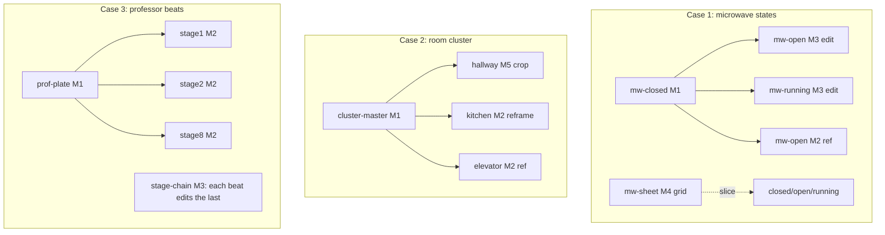

# Consistency-reference probes

Yak: `gnusto-819a`. Feeds `gnusto-eadc` (event :rdescs reference room/objects) and
`docs/render.md`.

The static pipeline (`docs/render.md`) already nails **style** consistency: the
world `:visual-style` preamble rides on every brief. What it does *not* yet solve
is **identity / structural** consistency between *related* images:

1. **Object states** — the microwave must look like the *same* microwave when
   closed, open, and running.
2. **Cross-visible rooms** — the 2nd-floor cluster (hallway / kitchen / elevator /
   stairs) where rooms see *into* each other; what's glimpsed through the kitchen
   doorway in the hallway shot must agree with the kitchen's own establishing shot.
3. **Repeated character** — the professor must read as the same man across the
   eight `professor-ritual` beats.

This dir is a throwaway harness to find **which Gemini mechanism actually holds
these consistent**, before we commit a model into Grue/filfre. Style is held
fixed (real world `:visual-style`) so we isolate identity/structure. Briefs are
the *real* `:rdesc` text from the game.

## Mechanisms under test

| | Mechanism | Call shape | Best-guess fit |
|--|-----------|-----------|----------------|
| **M1** | Prompt-only (control) | text | baseline; style only |
| **M2** | Single **frozen reference** → fresh generation ("redraw THIS, now X") | text + 1 img | character beats, room cross-ref |
| **M3** | **In-place edit** of the prior image ("keep everything, change only the door") | text + 1 img | object states (it *is* an edit) |
| **M4** | **Model-sheet / grid** in one call, then PIL-slice | text → slice | object state-sets, char turnaround |
| **M5** | **Master plate → crop / reframe** | text → crop, or master + img | cross-visible room cluster |

Notes on *why* these, beyond the two the brief named (image-ref vs prompt-ref):

- **M3 (edit)** matters because Nano Banana is fundamentally an *editing* model.
  "Same image, only the microwave door opens" preserves far more than redrawing
  from a reference. Object state-sets are literally edits of one base.
- **M4 (grid)** produces all variants in a *single forward pass*, so they share
  identity maximally and cost one call. Classic character-model-sheet trick.
  Cost: lower per-panel resolution + approximate slicing.
- **M5 (master plate)** is the concrete form of the brief's "pre-merge reference":
  render one wide plate of the contiguous space, then derive each room as a crop
  (exact seam, PIL-only, no spend) or a model reframe (better framing, some drift).
- **Seed** is deliberately *not* a mechanism: a fixed seed reproduces the *same*
  prompt, but two different prompts at one seed do **not** share a face. Seed is a
  reproducibility knob, not a consistency lever. Recorded so we don't chase it.

## The DAG

Whatever wins, dependencies must be acyclic. The harness already runs nodes as a
tiny DAG (`Node.deps`), which doubles as a prototype of the eventual Grue model:

- **Frozen roots** are M1/M4 nodes with no deps (style only). They never reference
  anything, so they can't create a cycle.
- **Dependents** (M2/M3/M5) reference *only* frozen roots (or, for M3 chains, the
  immediately prior node — a path, still acyclic).
- The **mutual-visibility cycle** (kitchen ↔ hallway) is broken exactly as the
  brief intuited: a `cluster-master` root feeds *both* the hallway crop and the
  kitchen reframe. `master → {hallway, kitchen, elevator}`, no back-edge.



## Running

Requires `GEMINI_API_KEY` (or `GOOGLE_API_KEY`). Real runs **spend**; every case is
opt-in and dry-run prints the plan + call count first.

```bash
cd experiments/consistency

python probe.py --list                 # cases, mechanisms, node DAGs
python probe.py --dry-run microwave     # show composed prompts + DAG, NO api spend
python probe.py microwave               # run one case  -> out/<case>/*.png
python probe.py rooms professor         # run several
python probe.py --sheet microwave       # (re)assemble out/<case>/_sheet.png from existing PNGs
```

Outputs land in `out/<case>/<node>.png`, plus a `_sheet.png` contact sheet per
case for eyeballing consistency side-by-side. `out/` is git-ignored.

## Findings

### Case 1 — microwave states (Nano Banana Pro, ~1K) — run 1

Clear winner for object state-sets: **edit a frozen base in place (M3)**, with
**single-ref fresh generation (M2)** a close second.

| Mechanism | Identity vs. base | Notes |
|-----------|-------------------|-------|
| M3 edit | **excellent** | open/running keep the *same* unit, *same* framing and palette; only the door/glow changes. Best of all. |
| M2 ref | **very good** | same unit and near-identical framing; occasional small pose/angle drift. |
| M1 prompt-only | **poor (control)** | every state is a *different* microwave (angle, proportions, body). Confirms style-only consistency is not enough. |
| M4 grid | **failed (as built)** | the object-kind framing produced one round porthole-ish blob, not a 3-panel sheet; naive equal-column slicing is then meaningless. Needs explicit panel layout + a non-"isolated single subject" framing, or panel segmentation. Deprioritized — M3/M2 already solve this case. |

Secondary observation: the **closed** base read ambiguously (glowing LED + reflective
door looks half-open) because the object brief isolates it on black with no counter.
Closed-state briefs likely want "opaque closed door, no interior visible." This is a
brief-wording fix, independent of the consistency mechanism.

**Implication for the model:** an object with state variants should declare one
*base* variant (frozen root) and derive the others as edits/refs off it — i.e. the
`:rdesc` variant map needs a notion of "base + deltas," not N independent briefs.

### Case 2 — room cluster (Nano Banana Pro, ~1K) — run 1

The master-plate DAG works. `cluster-master` (prompt-only root) came back with
everything we need: elevator doors + call buttons (left), stairs at the far end,
and the kitchen (fridge + microwave on a counter) glimpsed through the right-hand
doorway — i.e. the cross-visibility is baked into the root.

| Mechanism | Boundary agreement | Notes |
|-----------|--------------------|-------|
| M2 ref (off master) | **good** | `kitchen-ref` inherits the master's cooler palette *and* the layout glimpsed through the doorway (microwave-on-counter, fridge right, warm accent). `elevator-ref` inherits palette/mood (the master only shows the doors from outside, so transfer is mood-level, not literal). |
| M5 crop (of master) | **exact, free** | `hallway-crop` is a literal sub-region of the master → perfect seam, zero spend. But it only shows what's already in the plate and can't reframe. |
| M1 prompt-only | **poor (control)** | `kitchen-prompt` is a *different*, warmer kitchen; `elevator-prompt` a different car. No agreement with the hallway glimpse. |

So for adjacent/cross-visible rooms: **ref the plate.** Prompt-only is not enough
once two rooms must agree at a shared boundary, and the consistency win here came
entirely from `M2 ref` — `kitchen-ref` agreeing with the doorway glimpse.

> **On crop (M5):** it is *not* a pillar of the approach, only an opportunistic
> optimization. The cycle-break is done by the frozen plate being a root and rooms
> referencing *it* (see Synthesis); crop is merely a free, exact-seam way to derive
> a room image *when that room is literally a sub-rectangle of the plate* — a narrow
> special case (it can't reframe, is capped at the plate's resolution, and
> `hallway-crop` even clipped the kitchen doorway). Drop it and nothing about the
> architecture changes. The room that *is* the locale (the hallway) can just **be**
> the plate; every other room is a ref-reframe off it.

### Case 3 — professor beats (Nano Banana Pro, ~1K) — run 1

The single most decisive case.

| Mechanism | Identity across beats | Notes |
|-----------|-----------------------|-------|
| M2 ref (off frozen `prof-plate`) | **good — the default** | every beat keeps the same gaunt, short-dark-haired man in the stained white coat, *and* each beat gets its own correct framing (incl. stage-8 seen from below through the trapdoor). Best balance of identity + per-beat composition. |
| M3 edit-chain | **excellent continuity, with caveats** | identity + lab geometry + pentagram position survive 5+ edits deep — superb *locked-camera* continuity. But it **locks framing** (stage-8 stayed in the wide lab instead of the trapdoor view → loses per-beat intent) and **accumulates finish/detail**, drifting off the rough-mockup style. |
| M1 prompt-only | **fails** | drifts the man's face *and costume* (a younger man in a dark jacket, not the white coat) and even stamped "MOCKUP - PANEL 3" into the art (took "rough mockup" literally). Unusable for a recurring character. |

## Synthesis & recommended model

One mechanism does not win everywhere; the requirement shape picks the mechanism:

| Requirement shape | Mechanism | In Grue terms |
|-------------------|-----------|---------------|
| State variants of one object (microwave) | **M3 edit** off a frozen base | `:rdesc` variant map = **base + deltas**, not N independent briefs |
| Recurring character across beats | **M2 ref** off a frozen character plate | beats declare a `:ref` to a character/anchor key; beats never ref each other → trivially acyclic |
| Continuous locked-camera cutscene | **M3 edit-chain** (accept framing lock + detail creep) | opt-in per event sequence |
| Cross-visible / adjacent rooms | **M2 ref** (reframe) off a **locale master plate** | a per-locale plate key is a root; rooms `:ref` the plate (the locale's own room can *be* the plate) |
| Anything style-only | M1 (already have it) | the `:visual-style` preamble |

The common thread: **introduce a frozen root** (base image / character plate / locale
plate / portal seam) and have dependents reference *it*, never each other. That is
what keeps the generation graph acyclic.

### Cycles in the wild

The room *visibility* graph is cyclic (adjacency/visibility is ~symmetric) and will
not topo-sort. We don't sort it — we **derive an acyclic generation graph** from it:

1. **Locale master plates** — cluster mutually-visible rooms; one prompt-only plate
   per locale is a root; rooms **ref** their plate instead of each other (crop is an
   optional free shortcut only when a room is a literal sub-view of the plate).
2. **Per-portal seam assets** — what must agree across a doorway is the *seam*, not
   the whole neighbour; one root asset per connection, both rooms ref it.
3. **Explicit author reference edges + a cycle lint** — a room's `:render`/`:rdesc`
   declares its refs; the manifest builder assembles the dep graph; the same
   abstract-interpretation lint that guards the scene-variant explosion **rejects
   cycles**, pointing the author at the exact edge to repoint at a plate/portal root.
   Auto where a spanning tree falls out (non-tree edges degrade to prompt-only);
   explicit override where it doesn't.

### Open follow-ups

- **Closed-microwave brief**: "opaque closed door, no interior visible" (base read
  half-open). Brief wording, not mechanism.
- **Edit detail-creep**: chained edits finish-up away from the rough style — may
  need a style-reassertion clause in the edit prompt, or cap chain length.
- **"Rough mockup" → literal text**: the style phrase occasionally gets painted in
  as a caption ("MOCKUP - PANEL 3"). Reword the style preamble to avoid words the
  model writes onto the canvas.
- **M4 grid**: deprioritized (failed as built); revisit only if a one-call
  state-set ever matters for cost.
- **M5 crop**: demoted to an opportunistic optimization, not a cycle-breaker; the
  room strategy is ref-off-plate (see Case 2 note).
